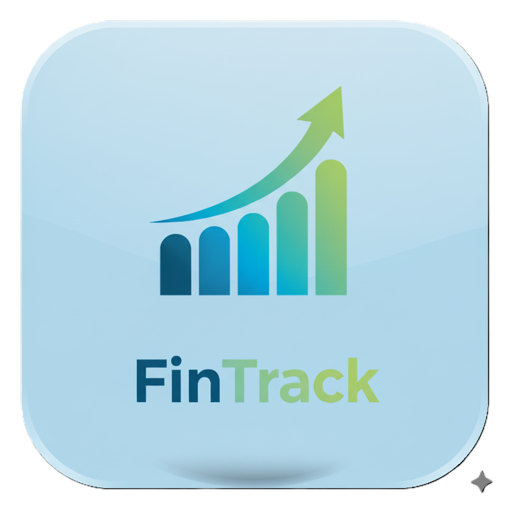

# Fintracker

<p align="center">
  
</p>


---

## 💡 Project Overview

**Fintracker** is a modern, AI-powered personal finance tracker built with TypeScript. Run it locally, connect to Google Gemini AI, and let powerful analytics help you understand and improve your financial life.

---

## 🚀 Key Features

- **Quick Transaction Logging:** Instantly record and categorize your income and expenses.
- **AI-Driven Insights:** Integrate with Gemini API for smart analysis and financial trend predictions.
- **Data Security:** Local deployment ensures your financial data remains private and under your control.
- **Modern Tech Stack:** Built with TypeScript and React for clean architecture and beautiful UI.
- **Responsive Design:** Seamless use across desktop and mobile devices.

---

## 🏁 Getting Started

### Prerequisites

- [Node.js](https://nodejs.org/) installed

### Setup Steps

1. Install dependencies
    ```
    npm install
    ```
2. Run the development server:
    ```
    npm run dev
    ```
3. Visit [http://localhost:3000](http://localhost:3000) to start using Fintracker!

---

## 🌐 Online Demo

- [Demo](https://fintrack.usefultools.qzz.io/)

---

## 🗂️ Directory Structure

- `components/` — UI components
- `utils/` — Utility functions
- Core files: `App.tsx`, `index.tsx`, `AddTransactionModal.tsx`, `AuthPage.tsx`
- Config files: `constants.tsx`, `manifest.json`, `metadata.json`, `package.json`

---

## 📦 Tech Stack

| Technology   | Purpose         |
|--------------|----------------|
| TypeScript   | Main language  |
| React        | Frontend       |
| HTML/CSS     | Styling/Layout |

---

## 🤝 How to Contribute

1. Fork the repository
2. Create a new branch and make your changes
3. Submit a detailed pull request

---

## 📝 License

This project is licensed under the MIT License. See [LICENSE](./LICENSE) for details.

---

## 💬 Contact

- GitHub: [Alex2003763](https://github.com/Alex2003763)

---

**Take control of your finances with Fintracker — the smart, AI-powered solution for managing every cent!**
